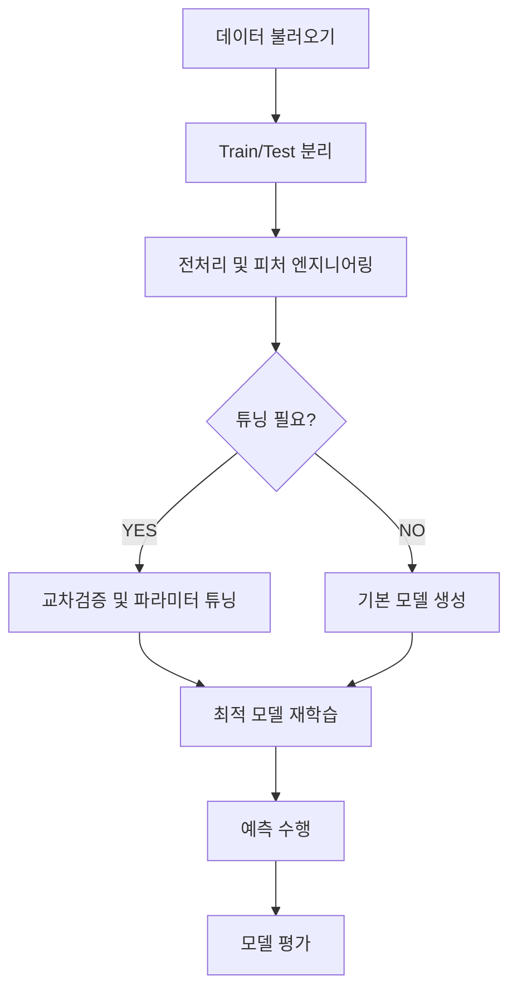

데이터 전처리 과정을 배우면서 사용했던 [Bike Sharing Data](https://www.kaggle.com/competitions/bike-sharing-demand/data?select=train.csv)의 `train.csv` 데이터셋으로 머신러닝 모델링을 알아보자. 

전처리를 진행 후 선형회귀 모델을 적용해 보았는데, 지표 평가에 따르면 굉장이 낮은 성능을 보였다. 

이를 개선하기 위해 할 수 있는 조치가 무엇이 있을까?

---

# 교차 검증(Cross Validation)
우선 전체적인 ML 모델링 과정은 다음과 같은 FLOW를 따른다.


## 교차 검증이 필요한 이유

우리가 ML 모델링 초기에 데이터를 훈련 데이터와 테스트 데이터로 분리했다. 

만약 이대로 데이터를 훈련 및 예측에 사용한다면, 모델은 훈련 데이터에 대해 잘 학습할 수 있지만 테스트 데이터에 대해서는 잘 예측할 수 없다. 

그러면 우리는 모델이 훈련을 잘했나 검사하면 된다. 그 역할을 하는 것이 바로 **<mark>교차 검증</mark>**이다.

> ### $$ \text{RMSLE} = \sqrt{\frac{1}{n} \sum_{i=1}^{n} (\log(y_i + 1) - \log(\hat{y}_i + 1))^2} $$
> 보통 같으면 **RMSE**를 사용했지만, 검증에 필요한 평가 지표로 여기서는 **RMSLE**를 사용한다. <br>
> 데이터셋에 존재하는 일부 큰 값의 오차에 모델이 과도하게 영향 받는 것을 방지하고자 로그를 취한 RMSLE를 사용했다. <br>
> 또한 과소 예측에 큰 페널티를 부여할 수 있는 로그 특성상 수요 예측 문제에 적절한 지표로 사용된다.

사이킷런의 `make_scorer` 메서드를 이용해 검증 지표를 계산하는 Scorer를 생성하자.

```python
from sklearn.metrics import make_scorer

def rmsle(y_true, y_pred):
    log_true = np.log1p(np.maximum(y_true, 0))
    log_pred = np.log1p(np.maximum(y_pred, 0))
    squared_error = (log_true - log_pred) ** 2
    return np.sqrt(np.mean(squared_error))

# Scikit-learn에서 사용 가능하도록 scorer 생성
rmsle_scorer = make_scorer(rmsle, greater_is_better=False)
```
## K-Fold Cross-Validation

교차 검증은 단순히 훈련 데이터를 `train_test_split` 메서드로 한번 더 분리해 훈련 데이터와 검증 데이터로 분리하면 그만이다.

그러나 이 방법의 경우 단순히 데이터를 구간으로 나누기 떄문에 모델 성능에 왜곡을 발생시킬 우려가 있다.

사이킷런이 제공하는 **<mark>K-Fold Cross-Validation</mark>**을 사용해 훈련 데이터를 K개의 구간으로 나누고, 각 구간을 검증 데이터로 한번씩 사용하여 모델을 학습하고 평가한다.

그러면, **Gradient Boosting Regressor** 모델에 **K-Fold 교차검증**을 적용해보자.

```python
from sklearn.ensemble import GradientBoostingRegressor, RandomForestClassifier
from sklearn.model_selection import cross_val_score
import numpy as np

# 기본 파라미터의 그래디언트 부스팅 모델
gbr = GradientBoostingRegressor(random_state=42)

def k_fold_cross_validation(model, X, y, n_splits=5):
  scores = cross_val_score(model, X, y, cv=n_splits, scoring=rmsle_scorer)
  mean_score = -np.mean(scores) # 가장 큰 점수가 좋은 모델이므로 계산시 에러에 음수표기
  print(f"교차 검증 폴드별 RMSLE 점수: {-scores}")
  print(f"\\n평균 RMSLE 점수 (기본 모델): {mean_score:.4f}")

k_fold_cross_validation(gbr, X, y)

>>> 교차 검증 폴드별 RMSLE 점수: [1.01893429 0.64271354 0.77797345 0.70555275 0.61987557]
>>> 평균 RMSLE 점수 (기본 모델): 0.7530
```

첫째줄에 각 폴드별로 RMSLE 점수가 가지각색이고, 이를 평균낸 값이 마지막 줄의 출력임을 알 수 있다.

## Stratified K-Fold Cross-Validation

여기서는 그래디언트 부스팅 '회귀'모델을 다루었는데, 만약 '분류'모델을 사용하는 데이터 셋이 클래스 불균형이 매우 심하다면, 단순 데이터 구간 분할이 적용되는 일반적인 K-Fold 교차 검증은 올바른 검증을 할 수 없다. 

분류모델의 클래스 불균형을 해결하기 위해 **<mark>Stratified K-Fold Cross-Validation</mark>**을 사용한다.

핵심은 K개로 나눈 모든 구간이 정답 클래스의 비율을 유지하는 것이다. 

예를 들어 `n_splits=5`로 설정하면, 5개의 구간에 속한 데이터의 클래스 비율이 모두 동일하다는 것이다.

# 하이퍼파라미터 튜닝(Hyperparameter Tuning)

모델의 학습을 위해 인간이 직접 설정해주어야만 하는 파라미터를 **<mark>하이퍼파라미터</mark>**라고 한다.

예를 들어 K-Fold 과정에서 `n_splits` 같은 것 말이다.

그러나 공부를 잘하고 있는지 감독하는 우리의 입장에서 일일이 하이퍼 파라미터를 수정하고, 더불어 교차검증까지 실시해야 하니 매우 번거로운 일이다.

사이킷런은 교차 검증과 동시에, 하이퍼파라미터 튜닝을 위한 다양한 방법을 제공한다.

## Grid Search

사이킷런은 교차 검증과 하이퍼파리미터 튜닝을 동시에 가능하게 해주는 **<mark>GridSearchCV</mark>**를 제공한다.

GridSearchCV의 객체에 우리가 원하는 하이퍼파라미터의 **그리드**(범위라고 생각) 전달하기만 하면, 해당 구간에서 가능한 조합의 경우의 수를 모두 시도해 가장 최적의 파라미터 값을 도출한다.

```python
from sklearn.model_selection import GridSearchCV

# 탐색할 하이퍼파라미터 그리드 설정
param_grid = {
    'n_estimators': [100, 200, 300],
    'learning_rate': [0.05, 0.1],
    'max_depth': [4, 5],
    'subsample': [0.8, 1.0]
}

# GridSearchCV 객체 생성
grid_search = GridSearchCV(
    estimator=GradientBoostingRegressor(random_state=42),
    param_grid=param_grid,
    scoring=rmsle_scorer,
    cv=3,
    n_jobs=-1,
    verbose=2
)

# 그리드 서치 실행 (시간이 다소 소요될 수 있습니다)
grid_search.fit(X, y)

print(f"\\n최적의 하이퍼파라미터: {grid_search.best_params_}")
print(f"최적 파라미터 적용 시 RMSLE 점수: {-grid_search.best_score_:.4f}")

# 최적의 모델 저장
best_model = grid_search.best_estimator_

>>> Fitting 3 folds for each of 24 candidates, totalling 72 fits
>>> 최적의 하이퍼파라미터: {'learning_rate': 0.05, 'max_depth': 5, 'n_estimators': 100, 'subsample': 0.8}
>>> 최적 파라미터 적용 시 RMSLE 점수: 0.5623
```

GridSearch를 통해 최적의 하이퍼파라미터를 우리가 일일이 적용해보지 않고도 구할 수 있게 되었다!

## Random Search

처음으로 하이퍼 파라미터를 튜닝하거나 모델의 성능을 검증할때, 이런 고민이 있을 것이다.

<br>

$$ \text{"최적의 파라미터를 어디서부터 찾아야 하지?"} $$

<br>

해당하는 파라미터의 값이 수치라면, 어느 구간을 먼저 잡아야 할지 결정하는 것이 쉽지 않을 것이다. 

사이킷런의 **<mark>RandomizedSearchCV</mark>**를 사용하면, 구간 설정에 도움이될 것이다.

정확히는 파라미터의 값을 전달하는 것이 아닌, 파라미터를 **샘플링** 할 수 있는 **확률분포** 객체를 전달한다.

`Scipy.Stats`의 서브패키지인 `Uniform`, `randint`를 통해 알아보자. 

```python
from scipy.stats import uniform, randint
from sklearn.model_selection import RandomizedSearchCV
from sklearn.ensemble import GradientBoostingRegressor

# 탐색 구간을 더 넓게 봐도 된다. (랜덤 서치의 장점)
params = {
    'n_estimators': randint(100, 500),       
    'learning_rate': uniform(0.01, 0.2),     
    'max_depth': randint(3, 10),           
    'subsample': uniform(0.6, 0.4)         
}

# 랜덤서치 객체 생성 (n_iter가 짧을수록 더 빠르다.)
rs = RandomizedSearchCV(
    GradientBoostingRegressor(random_state=42), 
    params, 
    n_iter=30, 
    n_jobs=-1, 
    random_state=42, 
    scoring=rmsle_scorer
)

rs.fit(X, y)
```

출력이 좀 특이한데, 이미지를 보면.. 


_출력값의 토글($\triangleright$)을 눌러보면?_


_RandomizedSearchCV의 상세정보를 확인할 수 있다._

오, 값이 정말 특이하다. 0.5, 0.6 ...과 같이 딱 떨어지는 값으로 파라미터가 정해지는 GridSearch와는 다르게 RandomSearch는 소수점까지도 정확하게 파라미터를 정해준다.

반복횟수(`n_iter`)를 단 20번만에 GridSearch가 찾지못한 최적의 비율을 찾아냈다는 것이 RandomSearch의 장점을 돋보이게 해준다.

만약, 데이터 경진대회 같이 모델의 점수를 극한으로 올리고 싶다면, RandomSearch를 사용해 최적의 구간을 찾아내고, GridSearch를 사용해 다시 한번 최적의 파라미터를 찾아내는 것도 좋은 방법일 것이다.

