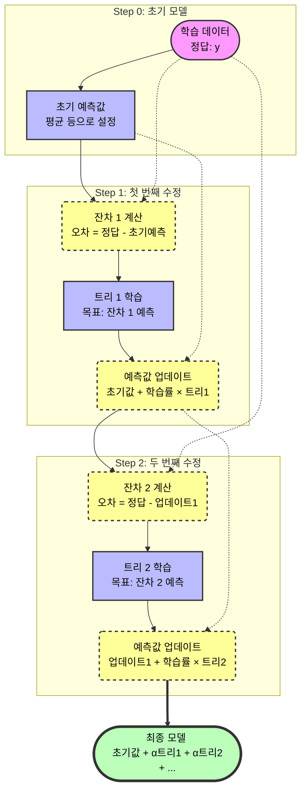
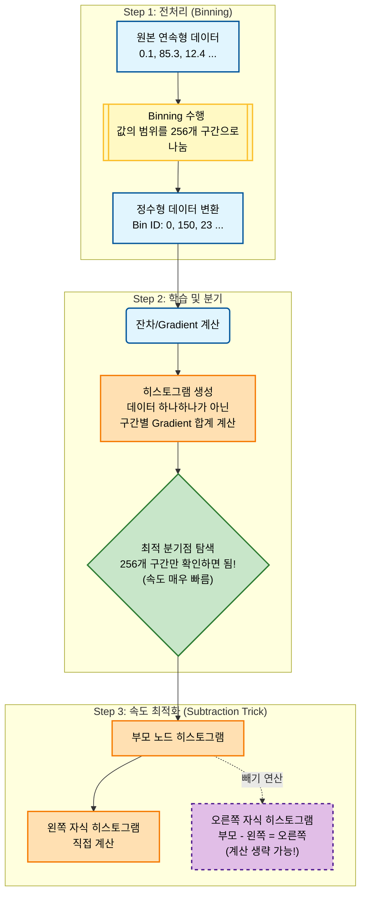

# 부스팅(Boosting)

$$ \text{"약한 학습기로 강한 학습기를 만들수는 없을까?"} $$

**<mark>부스팅(Boosting)</mark>**은 이러한 관점에서 탄생했다. 

이전 포스트에서 결정트리에 대해 알아보았는데, 부스팅에서 대표적인 약한 분류기(weak learner)가 바로 **깊이가 얕은 결정트리**이다.

배깅과 같이 모델을 **병렬(parallel)**로 학습하는 것이 아닌, **순차적으로(sequentially)** 학습한다.

순차적으로 학습한다는 것은 이전 모델이 학습한 결과를 기반으로 다음 모델이 학습에 영향을 받는다는 것이다.

여러가지 부스팅 알고리즘이 존재하는데, 이를 통해 학습하는 방식을 알아보자.

# GBM(Gradient Boosting Machine)

**<mark>GBM</mark>**은 나중에 배우게 될 **경사하강법**을 핵심 원리로 사용하는 알고리즘이다.

여기에서 간단하게 설명하자면, 우리가 '손실 함수'라고 부르는 **산의 가장 낮은 곳**을 찾아 내려오는 과정이라고 할 수 있겠다.

첫 번째 트리는 원래 정답을 맞추는 게 아닌, 앞선 모델이 틀린 **오차(잔차, Residual)**를 학습 목표로 삼는다. 

그리고 결과가 생성되면 다음 트리로 넘어가는 **순차적인 구조**를 보인다.

학습 업데이트 과정에서 GBM은 학습률(`learning_rate`)과 트리의 개수(`n_estimators`)를 점진적으로 증가시키는 방식으로 성능향상을 기대한다.

또한 `Subsample`을 통해 각 트리의 학습에 쓰이는 훈련세트의 비율을 조정할 수 있는데, 역시 경사하강법에 관련이 깊은 내용이니 나중에 더 자세히 알아보겠다.

최종적으로 도출된 모델은 초기 예측값에 수많은 작은 나무들의 예측값을 조금씩 더한 형태가 되기 때문에 GBM이 높은 성능을 보여준다.

---
# HistGradientBoosting

앞서 살펴본 GBM은 순차적인 학습 방식으로 인해 **훈련 속도가 느리다**는 단점이 있다. (`n_jobs` 파라미터가 없다)

GBM의 속도와 성능을 더욱 강화한 방식이 바로 **<mark>히스토그램 기반 그레디언트 부스팅(HistGradientBoosting)</mark>**이다.

히스토그램 기반 그레디언트 부스팅의 핵심은 **입력 데이터를 256개의 구간(Bin)으로 노드를 분할**해 최적의 분할을 매우 빠르게 찾을 수 있다는 것이다.

어떤 특성이 중요한지 확인 할 수 있는 특성 중요도를 간단하게 알아보자면 히스토그램이라는 통계학 관점에서 부스팅을 사용하므로

`permutation_importance()` 함수를 통해 반복하여 얻은 특성 중요도(`importance`), 평균(`importance_mean`), 표준편차(`importance_std`)를 확인할 수 있다.

---

📚 Reference

- 박해선, 『혼자 공부하는 머신러닝 + 딥러닝』, 한빛미디어(2020)
- 권철민, 『파이썬 머신러닝 완벽 가이드』, 위키북스(2019)
- [사이킷런 공식문서](https://scikit-learn.org/stable/modules/tree.html)
