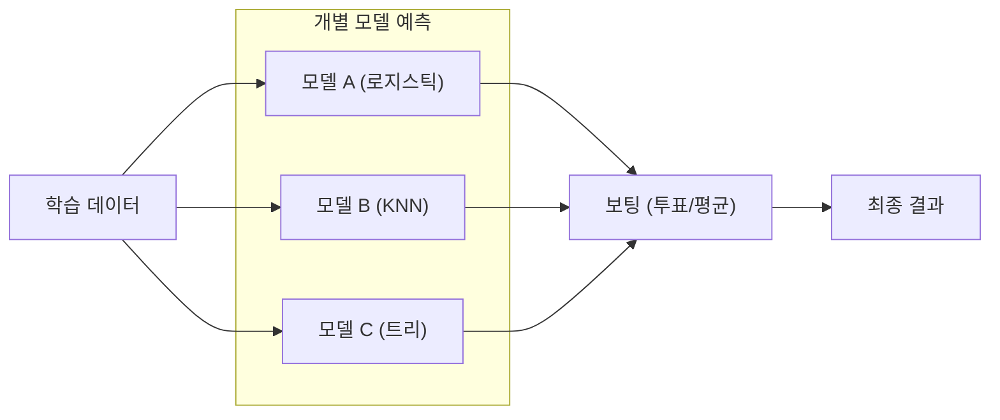
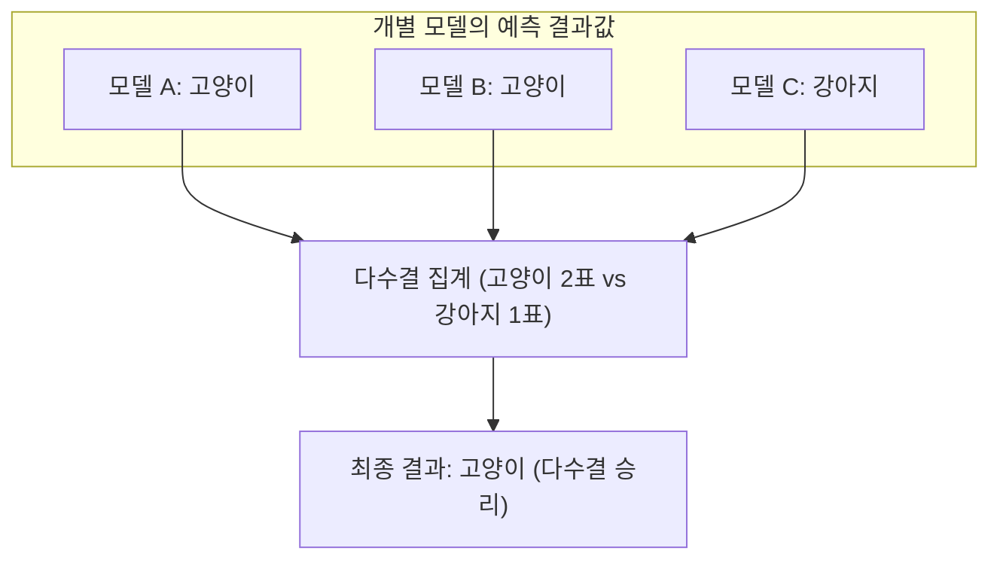
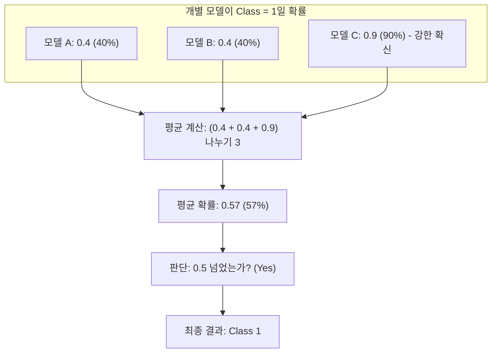
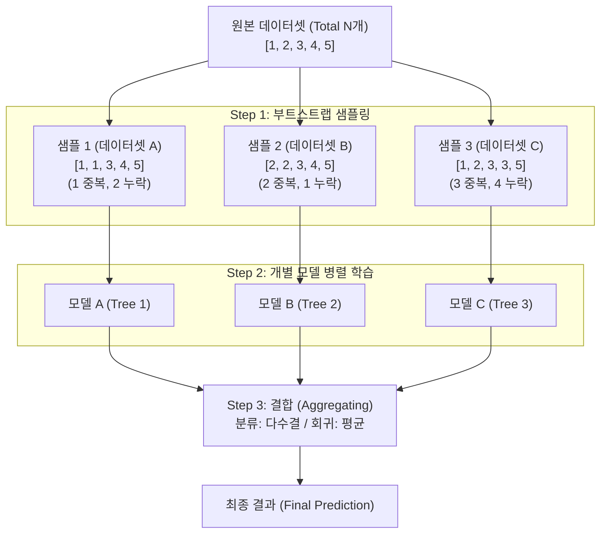
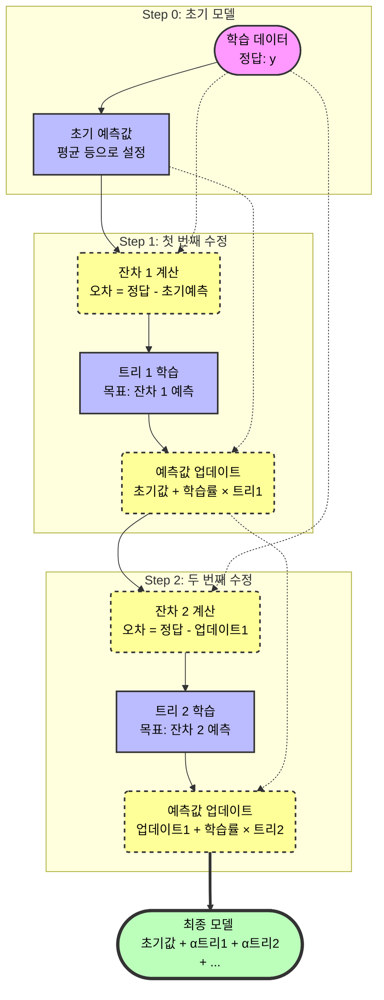
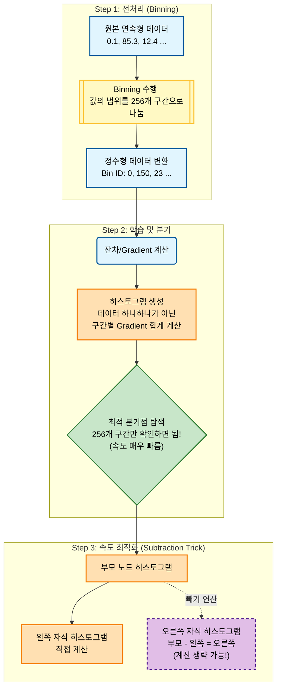
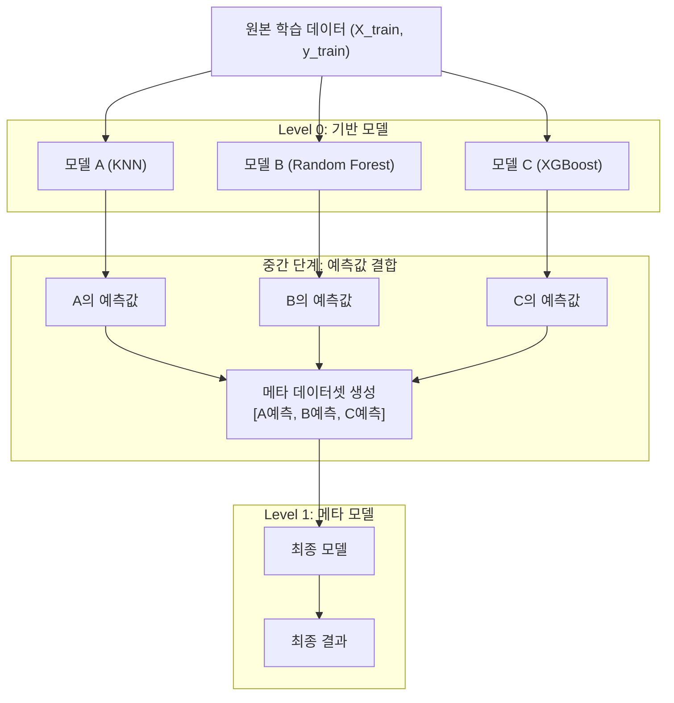
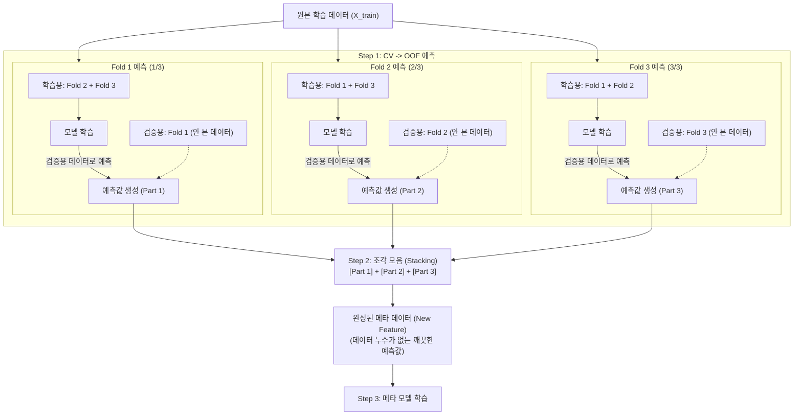

# 앙상블(Ensemble)

**<mark>앙상블(Ensemble)</mark>**이라고 하면, **음악 연주회**가 먼저 떠오를 것이다.

여러가지 악기들의 합주로 아름다운 선율을 만들어내는 것처럼, 머신러닝에서도 여러가지 모델을 통해 최적화된 결과를 도출하는 것이 바로 앙상블 기법이다.

앙상블 기법에는 다양한 방법이 있는데, 하나씩 알아보도록 하자.

# 보팅(Voting)

**<mark>보팅(Voting)</mark>**은 다수의 모델이 데이터셋 자체로 부터 예측한 각각의 값들 중 **가장 많이 나온 값**을 최종 예측값으로 사용하는 방식이다. 

```mermaid
graph LR
    Input["학습 데이터"] 
    
    subgraph Ensemble ["개별 모델 예측"]
        M1["모델 A (로지스틱)"]
        M2["모델 B (KNN)"]
        M3["모델 C (트리)"]
    end

    VoteSystem["보팅 (투표/평균)"]
    Result["최종 결과"]

    Input --> M1
    Input --> M2
    Input --> M3

    M1 --> VoteSystem
    M2 --> VoteSystem
    M3 --> VoteSystem

    VoteSystem --> Result
```

즉, 이름에서 알 수 있듯이 투표를 통해 다수결의 원칙을 적용한 것이라고 생각하면 편하다.

이 투표를 하는 과정에서 최종 결과값을 선정하는 기준에 따라 **하드 보팅(hard voting)**과 **소프트 보팅(soft voting)**으로 구분된다.

- **<mark>하드 보팅(hard voting)</mark>** : 다수결의 원칙으로 가장 많이 나온 값을 최종 예측값으로 사용

```mermaid
graph TD
    subgraph Predictions ["개별 모델의 예측 결과값"]
        P1["모델 A: 고양이"]
        P2["모델 B: 고양이"]
        P3["모델 C: 강아지"]
    end

    Count["다수결 집계 (고양이 2표 vs 강아지 1표)"]
    
    Final["최종 결과: 고양이 (다수결 승리)"]

    P1 --> Count
    P2 --> Count
    P3 --> Count
    Count --> Final
```

- **<mark>소프트 보팅(soft voting)</mark>** : 각 모델이 예측한 확률값을 평균하여 최종 예측값으로 사용

```mermaid
graph TD
    subgraph Probability ["개별 모델이 Class = 1일 확률"]
        M1["모델 A: 0.4 (40%)"]
        M2["모델 B: 0.4 (40%)"]
        M3["모델 C: 0.9 (90%) - 강한 확신"]
    end

    Calc["평균 계산: (0.4 + 0.4 + 0.9) 나누기 3"]
    
    Avg["평균 확률: 0.57 (57%)"]
    
    Decision["판단: 0.5 넘었는가? (Yes)"]

    Result["최종 결과: Class 1"]

    M1 --> Calc
    M2 --> Calc
    M3 --> Calc
    
    Calc --> Avg
    Avg --> Decision
    Decision --> Result
```

> 💡 일반적으로 소프트 보팅이 가장 많이 사용된다.

# 배깅(Bagging)

**<mark>배깅(Bagging)</mark>**도 보팅과 같이 결론을 도출하는 원리는 비슷하나 2가지 다른 특징을 가지고 있다.

```mermaid
graph TD
    %% 0단계: 원본 데이터
    Origin["원본 데이터셋 (Total N개)<br/>[1, 2, 3, 4, 5]"]

    %% 1단계: 부트스트랩 샘플링
    subgraph Bootstrap ["Step 1: 부트스트랩 샘플링"]
        direction TB
        %% 복원 추출이므로 1이 두 번 나오고, 2가 빠지는 등 변화가 생김
        S1["샘플 1 (데이터셋 A)<br/>[1, 1, 3, 4, 5]<br/>(1 중복, 2 누락)"]
        S2["샘플 2 (데이터셋 B)<br/>[2, 2, 3, 4, 5]<br/>(2 중복, 1 누락)"]
        S3["샘플 3 (데이터셋 C)<br/>[1, 2, 3, 3, 5]<br/>(3 중복, 4 누락)"]
    end

    %% 2단계: 모델 학습
    subgraph Training ["Step 2: 개별 모델 병렬 학습"]
        M1["모델 A (Tree 1)"]
        M2["모델 B (Tree 2)"]
        M3["모델 C (Tree 3)"]
    end

    %% 3단계: 결합
    Agg["Step 3: 결합 (Aggregating)<br/>분류: 다수결 / 회귀: 평균"]
    Final["최종 결과 (Final Prediction)"]

    %% 연결선
    Origin --> S1
    Origin --> S2
    Origin --> S3

    S1 --> M1
    S2 --> M2
    S3 --> M3

    M1 --> Agg
    M2 --> Agg
    M3 --> Agg

    Agg --> Final
```

1. 사용되는 모델이 전부 같은 모델 
- 약한 분류기로 사용되는 모델이 전부 하나의 모델을 사용한다. (랜덤포레스트 : 결정트리)

2. 데이터셋 자체에서 일부를 샘플링해서 사용
- 이러한 방식을 **부트스트랩(bootstrap)** 샘플링이라고 한다.

배깅의 대표적인 알고리즘으로는 **랜덤 포레스트(Random Forest)**가 있다.

수 많은 결정트리 모델이 **병렬적으로 학습**해 결과 도출이 빠르게 가능하고, **복원 추출**의 특성상 샘플링 되지 않은 데이터를 검증 데이터에 사용할 수 있는 **OOB(Out-Of-Bag) 샘플링**이 가능하다.

그러나 설정해야 하는 하이퍼 파라미터의 개수가 너무 많고, 튜닝을 거치더라도 모델 성능이 드라마틱하게 향상되지는 않는다.

# 부스팅(Boosting)

$$ \text{"약한 학습기로 강한 학습기를 만들수는 없을까?"} $$

**<mark>부스팅(Boosting)</mark>**은 이러한 관점에서 탄생했다. 

이전 포스트에서 결정트리에 대해 알아보았는데, 부스팅에서 대표적인 약한 분류기(weak learner)가 바로 **깊이가 얕은 결정트리**이다.

배깅과 같이 모델을 **병렬(parallel)**로 학습하는 것이 아닌, **순차적으로(sequentially)** 학습한다.

순차적으로 학습한다는 것은 이전 모델이 학습한 결과를 기반으로 다음 모델이 학습에 영향을 받는다는 것이다.

여러가지 부스팅 알고리즘이 존재하는데, 이를 통해 학습하는 방식을 알아보자.

# GBM(Gradient Boosting Machine)

**<mark>GBM</mark>**은 나중에 배우게 될 **경사하강법**을 핵심 원리로 사용하는 알고리즘이다.

여기에서 간단하게 설명하자면, 우리가 '손실 함수'라고 부르는 **산의 가장 낮은 곳**을 찾아 내려오는 과정이라고 할 수 있겠다.

```mermaid

flowchart TD
    %% 스타일 정의
    classDef data fill:#f9f,stroke:#333,stroke-width:2px,color:black;
    classDef model fill:#bbf,stroke:#333,stroke-width:2px,color:black;
    classDef calc fill:#ff9,stroke:#333,stroke-width:2px,stroke-dasharray: 5 5,color:black;
    classDef final fill:#bfb,stroke:#333,stroke-width:4px,color:black;

    %% 1단계: 초기화
    subgraph Step0 [Step 0: 초기 모델]
        Input([학습 데이터 <br/> 정답: y])
        InitModel[초기 예측값 <br/> 평균 등으로 설정]
        Input --> InitModel
    end

    %% 2단계: 첫 번째 반복
    subgraph Step1 [Step 1: 첫 번째 수정]
        Res1(잔차 1 계산 <br/> 오차 = 정답 - 초기예측)
        Tree1[트리 1 학습 <br/> 목표: 잔차 1 예측]
        Update1(예측값 업데이트 <br/> 초기값 + 학습률 × 트리1)
        
        InitModel --> Res1
        Input -.-> Res1
        Res1 --> Tree1
        Tree1 --> Update1
        InitModel -.-> Update1
    end

    %% 3단계: 두 번째 반복
    subgraph Step2 [Step 2: 두 번째 수정]
        Res2(잔차 2 계산 <br/> 오차 = 정답 - 업데이트1)
        Tree2[트리 2 학습 <br/> 목표: 잔차 2 예측]
        Update2(예측값 업데이트 <br/> 업데이트1 + 학습률 × 트리2)

        Update1 --> Res2
        Input -.-> Res2
        Res2 --> Tree2
        Tree2 --> Update2
        Update1 -.-> Update2
    end

    %% 최종 단계
    Final([최종 모델 <br/> 초기값 + α트리1 + α트리2 + ...])
    Update2 ==> Final

    %% 클래스 적용
    class Input data;
    class Tree1,Tree2 model;
    class Res1,Res2,Update1,Update2 calc;
    class Final final;
    class InitModel model;

```
첫 번째 트리는 원래 정답을 맞추는 게 아닌, 앞선 모델이 틀린 **오차(잔차, Residual)**를 학습 목표로 삼는다. 

그리고 결과가 생성되면 다음 트리로 넘어가는 **순차적인 구조**를 보인다.

학습 업데이트 과정에서 GBM은 학습률(`learning_rate`)과 트리의 개수(`n_estimators`)를 점진적으로 증가시키는 방식으로 성능향상을 기대한다.

또한 `Subsample`을 통해 각 트리의 학습에 쓰이는 훈련세트의 비율을 조정할 수 있는데, 역시 경사하강법에 관련이 깊은 내용이니 나중에 더 자세히 알아보겠다.

최종적으로 도출된 모델은 초기 예측값에 수많은 작은 나무들의 예측값을 조금씩 더한 형태가 되기 때문에 GBM이 높은 성능을 보여준다.

---
# HistGradientBoosting

앞서 살펴본 GBM은 순차적인 학습 방식으로 인해 **훈련 속도가 느리다**는 단점이 있다. (`n_jobs` 파라미터가 없다)

GBM의 속도와 성능을 더욱 강화한 방식이 바로 **<mark>히스토그램 기반 그레디언트 부스팅(HistGradientBoosting)</mark>**이다.

히스토그램 기반 그레디언트 부스팅의 핵심은 **입력 데이터를 256개의 구간(Bin)으로 노드를 분할**해 최적의 분할을 매우 빠르게 찾을 수 있다는 것이다.

```mermaid
flowchart TD
    %% 스타일 정의
    classDef raw fill:#e1f5fe,stroke:#01579b,stroke-width:2px,color:black;
    classDef bin fill:#fff9c4,stroke:#fbc02d,stroke-width:2px,color:black;
    classDef hist fill:#ffe0b2,stroke:#f57c00,stroke-width:2px,color:black;
    classDef split fill:#c8e6c9,stroke:#2e7d32,stroke-width:2px,color:black;
    classDef optim fill:#e1bee7,stroke:#4a148c,stroke-width:2px,stroke-dasharray: 5 5,color:black;

    %% 1단계: 전처리
    subgraph Preprocessing ["Step 1: 전처리 (Binning)"]
        RawData["원본 연속형 데이터 <br/> 0.1, 85.3, 12.4 ..."]:::raw
        Binning[["Binning 수행 <br/> 값의 범위를 256개 구간으로 나눔"]]:::bin
        BinnedData["정수형 데이터 변환 <br/> Bin ID: 0, 150, 23 ..."]:::raw
        
        RawData --> Binning --> BinnedData
    end

    %% 2단계: 히스토그램 생성
    subgraph Training ["Step 2: 학습 및 분기"]
        CalcGrad("잔차/Gradient 계산"):::raw
        
        BuildHist["히스토그램 생성 <br/> 데이터 하나하나가 아닌 <br/> 구간별 Gradient 합계 계산"]:::hist
        
        BinnedData --> CalcGrad --> BuildHist
        
        FindSplit{"최적 분기점 탐색 <br/> 256개 구간만 확인하면 됨! <br/> (속도 매우 빠름)"}:::split
        
        BuildHist --> FindSplit
    end
    
    %% 3단계: 최적화 기법
    subgraph Trick ["Step 3: 속도 최적화 (Subtraction Trick)"]
        ParentHist["부모 노드 히스토그램"]:::hist
        LeftHist["왼쪽 자식 히스토그램 <br/> 직접 계산"]:::hist
        RightHist["오른쪽 자식 히스토그램 <br/> 부모 - 왼쪽 = 오른쪽 <br/> (계산 생략 가능!)"]:::optim
        
        ParentHist --> LeftHist
        ParentHist -. "빼기 연산" .-> RightHist
    end

    FindSplit --> ParentHist
```
앙상블 기법의 병렬 학습이 속도가 매우 느리다는 점을 보완한 부스팅 기법으로 대표적인 알고리즘이 **XGBoost**와 **LightGBM**이 있다.

뛰어난 성능으로 분류 알고리즘에서 가장 많이 쓰이기 때문에, 두 알고리즘에 대해서도 추후 자세히 정리해 보겠다.

# 스태킹(Stacking)

**<mark>스태킹(Stacking)</mark>**은 여러 모델의 개별 예측 데이터를 결합한 데이터로 새로운 모델에 학습하는 방식이다.

이렇게 학습된 모델을 **메타 모델(Meta Model)**이라고 하는데, 최종 메타 모델에 도달할 때까지 여러 개의 기반 모델이 사용된다.

기본적인 원리는 배깅과 부스팅과 차이는 없지만 이러한 점이 스태킹의 특징이다.

```mermaid
graph TD
    %% 1. 원본 데이터
    Input["원본 학습 데이터 (X_train, y_train)"]

    %% 2. Level 0: 기반 모델들
    subgraph Level_0 ["Level 0: 기반 모델"]
        direction TB
        M1["모델 A (KNN)"]
        M2["모델 B (Random Forest)"]
        M3["모델 C (XGBoost)"]
    end

    %% 3. 예측값 모으기 (이게 핵심!)
    subgraph New_Features ["중간 단계: 예측값 결합"]
        P1["A의 예측값"]
        P2["B의 예측값"]
        P3["C의 예측값"]
        
        NewData["메타 데이터셋 생성<br/>[A예측, B예측, C예측]"]
    end

    %% 4. Level 1: 메타 모델
    subgraph Level_1 ["Level 1: 메타 모델"]
        Meta["최종 모델"]
        Final["최종 결과"]
    end

    %% 연결 흐름
    Input --> M1
    Input --> M2
    Input --> M3

    M1 --> P1
    M2 --> P2
    M3 --> P3

    P1 --> NewData
    P2 --> NewData
    P3 --> NewData

    NewData --> Meta
    Meta --> Final
```

원리 구조 상 일반적인 스태킹을 사용할 경우, 이미 학습에 본 데이터를 다시 예측하게 되어 과적합이 발생할 우려가 있다.

스태킹 알고리즘에서 과적합 문제가 발생할 경우, 검증 세트를 기반으로한 스태킹을 통해 이를 해결할 수 있다.

```mermaid
graph TD
    %% 0. 시작
    RawData["원본 학습 데이터 (X_train)"]

    %% 1. CV 과정 (핵심)
    subgraph CV_Loop ["Step 1: CV -> OOF 예측"]
        direction TB
        
        %% Fold 1
        subgraph Iter1 ["Fold 1 예측 (1/3)"]
            TrainSet1["학습용: Fold 2 + Fold 3"]
            ValSet1["검증용: Fold 1 (안 본 데이터)"]
            ModelA1["모델 학습"]
            Pred1["예측값 생성 (Part 1)"]
            
            TrainSet1 --> ModelA1
            ModelA1 -- "검증용 데이터로 예측" --> Pred1
            ValSet1 -.-> Pred1
        end

        %% Fold 2
        subgraph Iter2 ["Fold 2 예측 (2/3)"]
            TrainSet2["학습용: Fold 1 + Fold 3"]
            ValSet2["검증용: Fold 2 (안 본 데이터)"]
            ModelA2["모델 학습"]
            Pred2["예측값 생성 (Part 2)"]
            
            TrainSet2 --> ModelA2
            ModelA2 -- "검증용 데이터로 예측" --> Pred2
            ValSet2 -.-> Pred2
        end

        %% Fold 3
        subgraph Iter3 ["Fold 3 예측 (3/3)"]
            TrainSet3["학습용: Fold 1 + Fold 2"]
            ValSet3["검증용: Fold 3 (안 본 데이터)"]
            ModelA3["모델 학습"]
            Pred3["예측값 생성 (Part 3)"]
            
            TrainSet3 --> ModelA3
            ModelA3 -- "검증용 데이터로 예측" --> Pred3
            ValSet3 -.-> Pred3
        end
    end

    %% 2. 합치기
    Merge["Step 2: 조각 모음 (Stacking)<br/>[Part 1] + [Part 2] + [Part 3]"]
    
    %% 3. 최종 결과
    NewFeature["완성된 메타 데이터 (New Feature)<br/>(데이터 누수가 없는 깨끗한 예측값)"]
    MetaModel["Step 3: 메타 모델 학습"]

    RawData --> Iter1
    RawData --> Iter2
    RawData --> Iter3

    Pred1 --> Merge
    Pred2 --> Merge
    Pred3 --> Merge

    Merge --> NewFeature
    NewFeature --> MetaModel
```

---

📚 Reference

- 박해선, 『혼자 공부하는 머신러닝 + 딥러닝』, 한빛미디어(2020)
- 권철민, 『파이썬 머신러닝 완벽 가이드』, 위키북스(2019)
- [사이킷런 공식문서](https://scikit-learn.org/stable/modules/tree.html)
