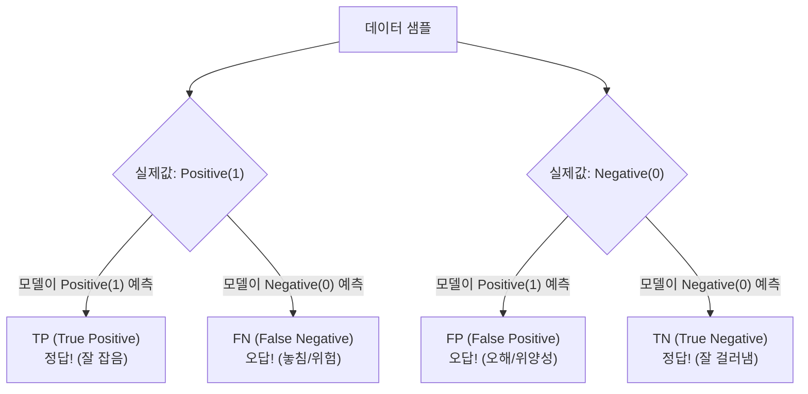
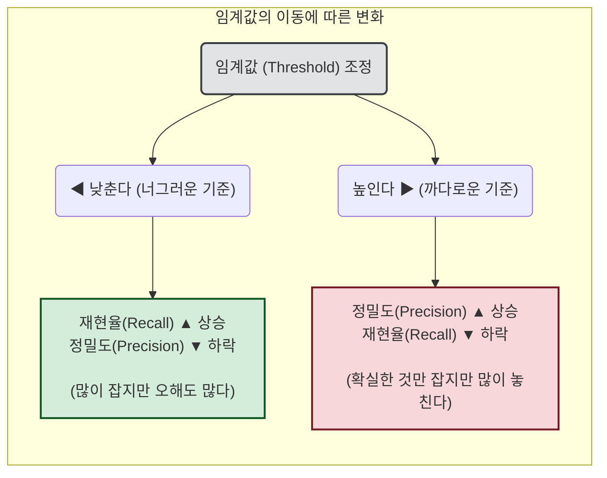
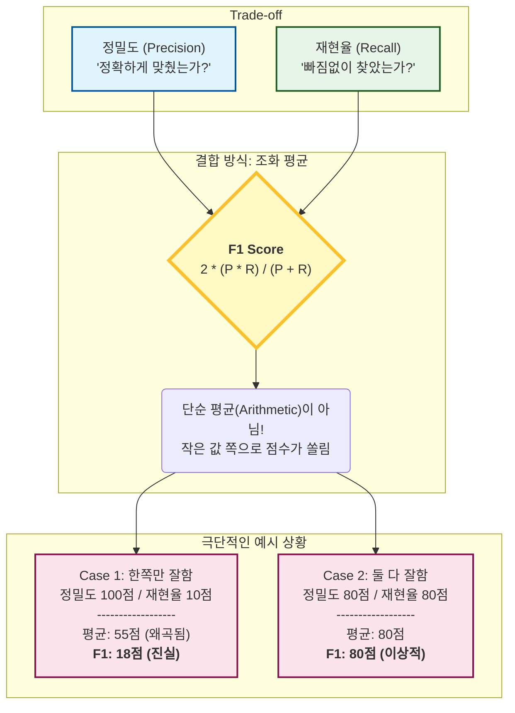

# 혼동행렬(confusion matrix)

**<mark>혼동행렬(confusion matrix)</mark>**은 분류 모델이 예측을 하는 과정에서 얼마나 헷갈렸는가(confuse)를 수치화할 수 있는 유용한 지표이다.

각 용어의 의미를 제대로 이해하지 못하면 이름처럼 인간도 혼동할 수 있기 때문에 혼동행렬을 정확하게 이해하는 것이 중요하다.

혼동행렬을 정확하게 이해하고 사용한다면 분류 모델의 예측 오차가 얼마인지, 어떤 유형의 오류를 범하고 있는지를 설명할 수 있다.

- **TP (True Positive)** : 실제값이 Positive(1)인 데이터를 Positive(1)로 제대로 예측한 경우
- **FP (False Positive)** : 실제값이 Negative(0)인 데이터를 Positive(1)로 잘못 예측한 경우 (오해/위양성)
- **FN (False Negative)** : 실제값이 Positive(1)인 데이터를 Negative(0)로 잘못 예측한 경우 (놓침/위험)
- **TN (True Negative)** : 실제값이 Negative(0)인 데이터를 Negative(0)로 제대로 예측한 경우

이 4가지의 지표를 이용해 분류 모델의 성능을 평가할 수 있는 여러 지표가 있다.

---

# 정확도(accuracy)

**<mark>정확도(accuracy)</mark>**는 예측 모델이 실제로 Positive, 혹은 Negative라고 정확히 맞춘 비율을 의미한다. 

$$ \text{Accuracy} = \frac{TP + TN}{TP + TN + FP + FN} $$

이 지표는 매우 직관적이고 쉽지만, 한 가지 주의해야 할 점은 **불균형 데이터셋**에서 정확도를 사용할 경우 **오해의 소지가 크다**는 것이다.

수식에서 생각해보면, 불균형 데이터셋의 특징으로 Negative 클래스 비율이 굉장히 많아 TN의 경우가 TP의 경우를 무시할 만할 정도로 많아진다.

$$ \text{TP} >> \text{TN} $$

따라서 모델이 예측과정에서 Negative 클래스로 예측을 찍기만 해도 정확도는 매우 높아질 수 있다.

이러한 문제를 해결하기 위해 Positive 클래스에 집중한 **정밀도(precision)**와 **재현율(recall)**이다.

---

# 정밀도(precision)와 재현율(recall)

**<mark>정밀도(precision)</mark>**는 모델이 예측한 Positive 클래스 중 실제 Positive 클래스로 예측한 비율을 의미한다.

$$ \text{Precision} = \frac{TP}{TP + FP} $$

수식을 잘 살펴보면, 모델이 Positive클래스로 예측한 경우(TP, FP) 중에서 TP, 즉 Positive라고 정확히 예측한 비율을 의미한다.

따라서 정밀도는 모델이 예측한 것이 실제로 해결하려는 목적에 맞게 분류가 되야하는 상황(예 : 스팸 메일 분류)에 매우 적합한 지표이다.

**<mark>재현율(recall)</mark>**은 모델이 예측에 성공한 경우 중 실제 Positive 클래스로 예측한 비율을 의미한다.

$$ \text{Recall} = \frac{TP}{TP + FN} $$ 

역시 수식을 보면, 모델이 올바르게 예측한 경우(실제값과 예측값이 동일한 TP, FN) 중에서 TP, 즉 Positive라고 정확히 예측한 비율을 의미한다.

때문에 재현율은 **모델이 올바르게 예측하지 못하면 결과(예 : 환자 진단)**에 지장이 큰 사례에 적용 되는 평가 지표이다.

정밀도와 재현율 모두 수식을 보면 TP를 높이는 데 중점이 되어있다. 다른 점은 재현율이 FN을, 정밀도가 FP를 낮추는 데 중점이 되어있다. 

> 💡 **정밀도와 재현율의 Trade-Off 현상**
>   정밀도와 재현율은 상호 보완적인 관계를 가지고 있으며, 이로 인해 발생하는 트레이드오프 현상도 고려해볼 점이다.
>   분류를 결정하는 임계값이 낮아질수록 Positive로 예측할 확률이 높아져 재현율이 증가하지만, 정밀도가 하락한다.
>   왜냐하면 임계값을 낮추어 기준을 너그럽게 하면 Positive일 확률이 늘어나기 때문이다.

주어진 모델의 업무 환경을 고려하여 **정밀도와 재현율 두 수치를 균형있게 해주는 임곗값을 조정하는 것이 중요하다.**

---

# F1 Score

정밀도와 재현율을 이용해 두 지표가 균형을 가지는 수치를 파악하려면 **<mark>F1 Score</mark>**를 사용한다.

$$ \text{F1 Score} = \frac{2}{\frac {1}{\text{recall}}+\frac {1}{\text{precision}}} = 2 \times \frac{\text{Precision} \times \text{Recall}}{\text{Precision} + \text{Recall}} $$

수식과 도표를 보면 알 수 있듯이, 결국 F1 score가 잘나오려면 정밀도와 재현율이 균형을 이루어야한다. 

어느 한쪽으로 치우쳐진 평가 지표가 있다면, F1 score는 좋은 평가 지표가 될 수 없다. 

다만 F1 score가 무작정 높다고해서도 좋은 것만은 아닌 이유가, 분류를 결정하는 임곗값에 따라 다를 수도 있다.

때문에 높은 F1 score가 도출되었다면, 임곗값을 조정하여 정밀도와 재현율 등 다른 평가 지표가 이상이 있는지 확인해봐야 한다.

---

# ROC Curve(Receiver Operating Characteristic Curve)

여기까지 임계값에 따라 다양한 평가지표가 어떻게 변화하는지 살펴보았는데, 모든 임곗값에서의 전체적인 모델 성능을 시각화하는 평가 지표가 있다. 

바로 **<mark>ROC 곡선</mark>**과 **<mark>AUC(Area Under the Curve)</mark>**이다.

우선 ROC 곡선을 알아보자. 2차원 곡선을 표현하기 위해서는 x,y축을 담당하는 지표가 필요하다.

먼저 y축의 경우를 보면, **<mark>TPR(True Positive Rate)</mark>**를 사용한다. 

직역하면 TP일 확률, 이는 우리가 앞서 살펴본 **재현율**을 의미한다.

$$ \text{TPR} = \frac{TP}{TP + FN} : \text{재현율}$$

실제 Positive인 경우가 정확히 예측되어야 하는 수준을 나타내는 재현율은 **<mark>민감도(Sensitivity)</mark>**라고도 표현한다.

민감도와 함께 대응하는 지표로 TNR(True Negative Rate), TN일 확률을 나타내는 **<mark>특이성(Specificity)</mark>**이 있다.

$$ \text{TNR} = \frac{TN}{TN + FP} : \text{특이성}$$

특이성은 민감도와 반대로 실제 Negative인 경우가 정확히 예측되어야 하는 수준을 나타낸다.

다음으로 x축을 보면, **<mark>FPR(False Positive Rate)</mark>**를 사용한다. 

FP일 확률이므로, 전체 확률에서 앞서 살펴본 **특이성**의 경우를 뺀 경우와 동일하다고 볼 수 있다.

$$ \text{FPR} = \frac{FP}{FP + TN} = 1 - \text{TNR}$$

앞에서 **정밀도와 재현율의 Trade-off 현상**을 다룰 때, 임곗값을 조정하면서 최적의 비율을 찾는 것이 중요하다고 했다.

임곗값을 조정하는 과정을 **ROC 곡선**에서 표현하면, x축의 **FPR**을 0에서 1까지 변경해가며 **TPR**의 변화값을 구하는 것이라고 생각하면 된다.

다음과 같은 ROC 곡선에서, **FPR을 낮추는 경우(A)**와 **FPR을 높이는 경우(C)**를 살펴보자.

먼저 **A의 경우(좌하단)**는 FPR이 매우 낮은 상태다. 이는 모델이 Positive(양성)라고 예측하는 기준을 매우 **'까다롭게'** 설정했다는 뜻이다. 

실제 Negative인 데이터를 Positive로 잘못 판단하는 비율(오진)이 낮으므로, 중요한 메일을 스팸으로 분류하면 안 되는 '스팸 메일 필터' 같은 시스템에서 선호하는 구간이다.

반면 **C의 경우(우상단)**를 보면 FPR이 증가했다. 이는 모델이 Positive라고 예측하는 기준을 **'너그럽게'** 설정했다는 뜻이다. 

비록 정상인을 환자로 오해(False Positive)하는 비율은 늘어났지만, 그만큼 실제 환자를 놓치지 않고 찾아낼 확률(TPR, 재현율)도 매우 높다. 

따라서 사람의 생명이 걸려 있어 단 한 명의 환자도 놓치면 안 되는 '암 환자 진단' 같은 시스템에서는, 오진이 좀 나오더라도 이 구간(높은 재현율)을 확보하는 것이 이상적이다.

---

# AUC(Area Under the Curve)

_이상적이고 완벽한 모델일수록 AUC가 1에 가까워진다._

ROC 곡선 자체만 보았을 때는 임곗값을 조정하는 것처럼 FPR, TPR의 변화를 확인하는 용도였다.

ROC 곡선 아래를 차지하는 **<mark>AUC(Area Under the Curve)</mark>**를 사용하면, 모델의 분류 성능을 실질적으로 확인할 수 있다.

FPR이 작은 상태에서 얼마나 큰 TPR을 얻을 수 있는가를 나타내는 AUC는 면적이 1에 가까울수록 좋은 성능을 가진다고 할 수 있다.

---

📚 Reference

- 박해선, 『혼자 공부하는 머신러닝 + 딥러닝』, 한빛미디어(2020)
- 권철민, 『파이썬 머신러닝 완벽 가이드』, 위키북스(2019)
- [Google Machine Learning Crash Course](https://developers.google.com/machine-learning/crash-course)