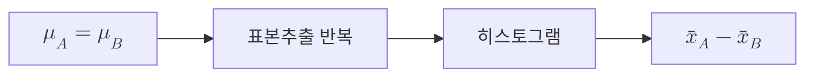
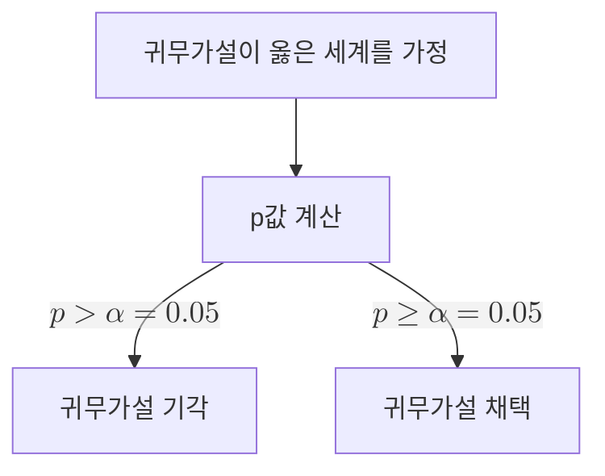

## 5.1 가설검정의 원리
> 추론통계의 원리로서 설정한 가설이 맞는지 확인하는 과정

**<mark>군(group)</mark>** : 특정 동일 조건 집단
- 실험군 : 실험하고자 하는 대상군
- 대조군 : 실험군과 비교하고자 하는 대상군

**<mark>대립가설($H_1$)</mark>** : 실험군과 대조군의 차이가 존재할 가능성이 있는 가설, 즉 우리가 밝히고자 하는 가설

**<mark>귀무가설($H_0$)</mark>** : 실험군과 대조군의 차이가 존재할 가능성이 없는 가설, 즉 우리가 밝히고자 하는 가설을 **부정**한 가설

$$ \begin{cases} H_0 : \mu_A = \mu_B\\ H_1 : \mu_A \neq \mu_B \end{cases}$$
 
 
❓ **모집단과 표본의 관계** : 모집단평균과 표본평균은 <u>일치하지 않는다</u>.

- 귀무가설이 옳다하더라도 데이터 퍼짐이 있는 모집단에서 표본을 추출할 때 생기는 표본오차로 인해 표본평균의 차이는 0이 될 수 없다.
- 우리는 표본평균의 차이($$\bar x_A - \bar x_B$$)가 귀무가설이 옳을때도 생기는 단순한 데이터 퍼짐인지 구별할 필요가 있다. 

**<mark>가설검정 FLOW</mark>**

1. 귀무가설이 옳은 세계를 가정 (두 모집단평균이 동일하게 $$\mu_A = \mu_B$$)

2. 모집단A와 모집단B에서 각각 표본을 추출 -> 여러번 반복

3. 히스토그램을 통해 표본평균차이의 분포를 확인

4. 해당 분포(이 분포는 귀무가설이 옳다고 '가정'한 분포)에서 실제 표본평균차이($$\bar x_A - \bar x_B$$)가 나타날 확률을 구한다.

**<mark>p값 (p-value)</mark>** : 귀무가설이 옳다고 가정했을 때, 관찰한 값 이상으로 극단적인 값이 나올 확률

- p값은 **<mark>유의수준 $\alpha$</mark>**를 기준으로 귀무가설과 현실 데이터 간의 괴리를 판단
- 만약 p값이 유의수준 $\alpha = 0.05$보다 작다면, 우리가 가정한 조건에서 발생할 확률이 너무 적으니 귀무가설을 **<mark>기각</mark>**할 이유가 된다. 따라서 우리는 귀무가설을 기각하고 대립가설을 **<mark>채택</mark>**한다.
- 이때 평균값의 차이는 **<mark>"통계적으로 유의미한 차이가 있다."</mark>**라고 표현한다.
> 만약 p값이 유의수준 $\alpha = 0.05$보다 크다면, 반대로 대립가설을 채택할 수 없다.

---

## 5.2 가설검정 시행

**<mark>이표본 t검정(two-sample t-test)</mark>** : 2개의 집단 간의 **평균값**을 비교하는 검정

(1) 두 집단의 평균값을 비교하므로 표본평균 - 모집단평균을 구한다.

$$ (\bar{x}_A - \bar{x}_B) - (\mu_A - \mu_B)$$

(2) 귀무가설이 옳다($$\mu_A = \mu_B$$)고 가정하면 위 식은 다음과 같이 된다.

$$ (\bar{x}_A - \bar{x}_B) - \cancelto{0}{\mu_A - \mu_B} = \bar{x}_A - \bar{x}_B $$

(3) 귀무가설이 옳은 가정에서 얻게된 표본평균차이가 나타나는 분포를 확인한다.
> 여기에서 표본평균차이가 평균이 $0$이고 표준편차가 $s\sqrt{\frac{1}{n_A}+\frac{1}{n_B}}$인 정규분포를 근사적으로 따른다.

(4) 이때 분포는 근사적인 분포이므로 표본평균차이를 $s\sqrt{\frac{1}{n_A}+\frac{1}{n_B}}$로 표준화한 **t값**을 사용한다.

**<mark>기각역</mark>** : 분산분포의 양 끝 2.5%씩의 발생 범위를 고려해 유의수준 5%인 기각역을 정의

- 실제로 얻은값이 기각역에 포함될 때는 $p < 0.05$가 되며, 귀무가설을 기각하게 된다.
- 귀무가설이 옳을때 t분포 내 위치를 구한 뒤 그 이상의 극단적인 값이 나올 확률은 기각역의 넓이가 된다.

> 기각역의 양수, 음수 양쪽을 모두 고려하는 가설검정 방법을 **<mark>양측검정</mark>**, 하나만 고려하는 것을 **<mark>단측검정</mark>**이라고 한다.

💡 신뢰구간과 가설검정의 관계

- $\mu_A - \mu_B$의 95% 신뢰구간이 0에 걸치는가? = p값이 0.05를 밑도는가?
- 표본평균으로 모집단평균을 추정하는 신뢰구간 = 귀무가설 가정을 통해 모집단평균차이를 0으로 고정했을 때 표본평균을 추정

$$ -2 \times s\sqrt{\frac{1}{n_A}+\frac{1}{n_B}} \le (\bar{x}_A - \bar{x}_B) - (\mu_A - \mu_B) \le +2 \times s\sqrt{\frac{1}{n_A}+\frac{1}{n_B}}$$

- $\mu_A - \mu_B$의 신뢰구간 : 표본평균차이$\bar{x}_A - \bar{x}_B$를 이항해 정리

$$  \bar{x}_A - \bar{x}_B - 2 \times s\sqrt{\frac{1}{n_A}+\frac{1}{n_B}} \le \mu_A - \mu_B \le \bar{x}_A - \bar{x}_B + 2 \times s\sqrt{\frac{1}{n_A}+\frac{1}{n_B}} $$

- 귀무가설 $\mu_A - \mu_B = 0$일때 가설검정 : 귀무가설을 대입

$$ -2 \times s\sqrt{\frac{1}{n_A}+\frac{1}{n_B}} \le \bar{x}_A - \bar{x}_B \le +2 \times s\sqrt{\frac{1}{n_A}+\frac{1}{n_B}}$$

**<mark>t검정 FLOW</mark>**

## 5.3 가설검정 관련 그래프

반복이 있는 데이터에서 평균값을 계산해 막대그래프나 산점도로 그릴 때 평균값에 더하여 그 위아래로 **<mark>오차 막대</mark>**를 함께 그린다.

이때 오차 막대가 무엇을 표시하고 있는지 그래프 **범례(legend)**에 반드시 기재해야 한다.

- 평균값의 확률을 나타내고 싶을 때 : 평균값 $\pm$ 표준오차(SEM)
- 신뢰구간을 나타내고 싶을 때 : 평균값을 중심으로 95%의 신뢰구간 표시
- 데이터 퍼짐을 나타내고 싶을 때 : 평균값 $\pm$ 표준편차(SE)

💡 "통계적으로 유의미"를 나타내는 표기

| 표기 | p-value |
| :---: | :---: |
| $\ast$ | $p < 0.05$ |
| $\ast\ast$ | $p < 0.01$ |
| $\ast\ast\ast$ | $p < 0.001$ |

## 5.4 제1종 오류와 제2종 오류

- 진실과 판단의 4패턴

|   | 귀무가설이 옳다 | 대립가설이 옳다 |
| :---: | :---: | :---: |
| 귀무가설 기각X | 옳은 판단 | 제2종 오류 확률 $\beta$ |
| 귀무가설 기각 | 제1종 오류 확률 $\alpha$ | 옳은 판단 |

- 제1종 오류 : 실제로는 아무런 차이가 없음에도 차이가 있다고 판단해버린 것
> 유의수준 $\alpha$를 미리 정의해 제1종 오류가 발생할 확률을 통제

- 제2종 오류 : 실제로는 차이가 있지만 차이가 없다고 판단해버린 것
> - 제2종 오류가 발생하지 않는 확률을 **<mark>검정력(power of test)</mark>**라고하고, 그 확률을 $1-\beta$로 표기
> - 일반적으로 $1-\beta \ge 0.8$를 목표로 한다.

- $\alpha$와 $\beta$의 관계 : 서로 **<mark>상충 관계</mark>** (한쪽이 작이지면 다른 한쪽이 커지는 관계)

- **<mark>효과크기(effect size)</mark>** : 일반적으로 얼마나 큰 효과가 있는지를 나타내는 지표

$$ d = \frac{\mu_A - \mu_B}{\sigma} $$

| 효과 크기 ($d$) | 의미 | 직관적 해석 (겹치는 정도) |
| :---: | :---: | :---: |
| $d = 0.2$ | 작은 효과 | 두 분포가 많이 겹침. (자세히 봐야 차이가 보임) |
| $d = 0.5$ | 중간 효과 | 눈에 띄는 차이가 있음. |
| $d = 0.8$ | 큰 효과 | 두 분포가 확연히 분리됨. (누가 봐도 차이가 남) |